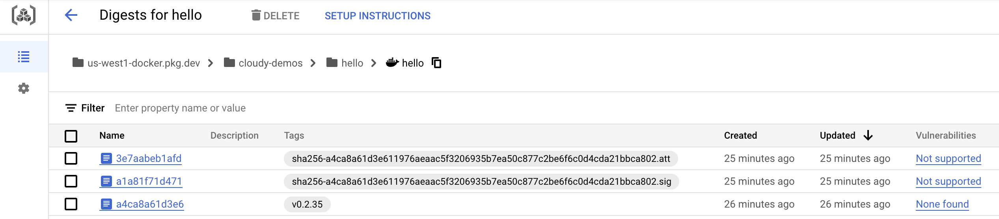
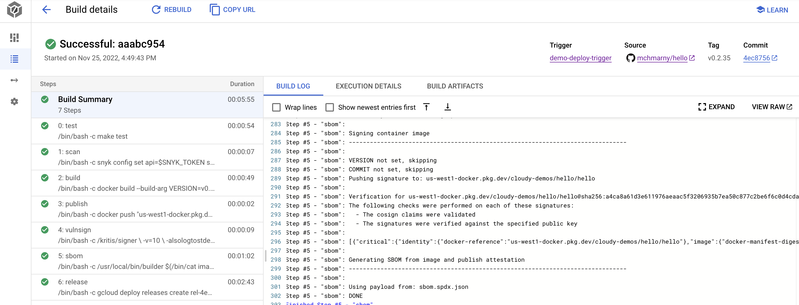

# sbominator

Custom build step for generating Software Bill of Materials (SBOM) for a container image. When added to your Google Cloud Build pipeline, it will:

* Sign an image using KMS key based on its digest
* Create SBOM attestation ([JSON SPDX format](https://github.com/spdx/spdx-spec/blob/v2.2/schemas/spdx-schema.json)) 
* (Optional) Create Binary Authorization attestation for a given attestor, and signs it with KMS key



## Setup 

First, enable the required APIs:

```shell
gcloud services enable \
  artifactregistry.googleapis.com \
  binaryauthorization.googleapis.com \
  cloudkms.googleapis.com \
  container.googleapis.com \
  containerregistry.googleapis.com \
  containersecurity.googleapis.com
```

### Cloud Build

To use this build step, the Cloud Build service account needs the following IAM roles:

* Binary Authorization Attestor Viewer: `roles/binaryauthorization.attestorsViewer`
* Cloud KMS CryptoKey Decrypter: `roles/cloudkms.cryptoKeyDecrypter`
* Cloud KMS CryptoKey Signer/Verifier: `roles/cloudkms.signerVerifier`
* Container Analysis Notes Attacher: `roles/containeranalysis.notes.attacher`

To ensure that the Cloud Build service account in your project has these roles:

```shell
export PROJECT_ID="<your project id>"

gcloud config set project $PROJECT_ID

export  PROJECT_NUMBER=$(gcloud projects list \
  --filter="$PROJECT_ID" \
  --format="value(PROJECT_NUMBER)")

export BUILD_SA="serviceAccount:${PROJECT_NUMBER}@cloudbuild.gserviceaccount.com"

gcloud projects add-iam-policy-binding $PROJECT_ID \
  --member $BUILD_SA \
  --role roles/binaryauthorization.attestorsViewer

gcloud projects add-iam-policy-binding $PROJECT_ID \
  --member $BUILD_SA \
  --role roles/cloudkms.cryptoKeyDecrypter

gcloud projects add-iam-policy-binding $PROJECT_ID \
  --member $BUILD_SA \
  --role roles/cloudkms.signerVerifier

gcloud projects add-iam-policy-binding $PROJECT_ID \
  --member $BUILD_SA \
  --role roles/containeranalysis.notes.attacher
```

### KMS 

Create a key ring and a key for asymmetric signing using:

> details: https://cloud.google.com/kms/docs/creating-asymmetric-keys

```shell
# replace if you want to deploy to a different location
export REGION="us-us-west1" 
export NAME="sbominator"
export KEY="${KEY_RING}-signer"

gcloud kms keyrings create $NAME \
  --project $PROJECT_ID \
  --location $REGION

gcloud kms keys create $KEY \
  --project $PROJECT_ID  \
  --location $REGION \
  --keyring $NAME \
  --purpose asymmetric-signing \
  --default-algorithm rsa-sign-pkcs1-4096-sha512
```

### Binary Authorization

Create attestation note:

```shell
curl "https://containeranalysis.googleapis.com/v1/projects/${PROJECT_ID}/notes/?noteId=${NAME}-note" \
  --request "POST" \
  --header "Content-Type: application/json" \
  --header "Authorization: Bearer $(gcloud auth print-access-token)" \
  --header "X-Goog-User-Project: ${PROJECT_ID})" \
  --data-binary @- <<EOF
    {
      "name": "projects/${PROJECT_ID}/notes/${NAME}-note",
      "attestation": {
        "hint": {
          "human_readable_name": "${NAME} note"
        }
      }
    }
EOF
```

Add the asymmetric signing key to the Attestor:

> details: https://cloud.google.com/sdk/gcloud/reference/alpha/container/binauthz/attestors/public-keys/add


```shell
gcloud container binauthz attestors create $NAME \
--project $PROJECT_ID \
--attestation-authority-note-project $PROJECT_ID \
--attestation-authority-note "${NAME}-note" \
--description "${NAME} attestor"

gcloud beta container binauthz attestors public-keys add \
--project $PROJECT_ID \
--attestor $NAME \
--keyversion "1" \
--keyversion-key $KEY \
--keyversion-keyring $NAME \
--keyversion-location $REGION \
--keyversion-project $PROJECT_ID
```

### Cloud Build config

Print the variables, and add them to substitutions in your `cloudbuild.yaml`:

> see [example/cloudbuild.yaml](example/cloudbuild.yaml) for example

```shell
echo "
_KMS_KEY: projects/${PROJECT_ID}/locations/${REGION}/keyRings/${NAME}/cryptoKeys/${KEY}/cryptoKeyVersions/1
_BIN_AUTHZ_ID: projects/${PROJECT_ID}/attestors/${NAME}
"
```


## Usage

When signing images it's best to do it based on image digest (not image tag). When publishing the image to GCP Artifact Registry, you should also extracted the digest of the newly published image. To enable other steps in the pipeline to access that digest, write it to a temporary file like this:

```shell
docker image inspect $IMAGE_TAG --format '{{index .RepoDigests 0}}' > image-digest.txt
```

To add the SBOM generation to your pipeline, add the following step to your pipeline, anywhere after the image is published and the digest is written to file:

```yaml
- id: sbom
  name: us-docker.pkg.dev/cloudy-tools/builders/sbominator@sha256:d863f7bdf10e63f9f43298e73aad5886b87245827497b8333c038d6c1d2bdc58
  entrypoint: /bin/bash
  env:
  - PROJECT=$PROJECT_ID
  - KEY=$_KMS_KEY
  - COMMIT=$COMMIT_SHA
  - VERSION=$TAG_NAME
  - ATTESTOR=$_BIN_AUTHZ_ID # optional - to add binary attestation
  args:
  - -c
  - |
    builder $(/bin/cat image-digest.txt)
```

> Both `COMMIT` sha `VERSION` tag are automatically included variables for for tag-triggered pipelines: 

A complete pipeline with all the steps in below image is available in the [example folder](example/cloudbuild.yaml).



## Technology 

This builder uses following open source projects:

* [cosign](https://github.com/sigstore/cosign) for signing
* [syft](https://github.com/anchore/syft) for SBOM generation 

Additionally, this builder users Google Cloud CLI ([gcloud](https://cloud.google.com/sdk/gcloud)) for environment configuration.

## Disclaimer

This is my personal project and it does not represent my employer. While I do my best to ensure that everything works, I take no responsibility for issues caused by this code.